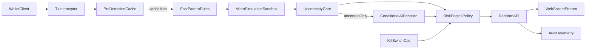

# Architecture

## Components

- `src/cache/riskCache.ts`: Redis + in-memory fallback cache for previous decisions.
- `src/engines/fastPatternEngine.ts`: low-latency deterministic pattern scoring.
- `src/engines/microSimulationEngine.ts`: constrained buy/sell/transfer simulation.
- `src/engines/aiDecisionEngine.ts`: uncertainty-only AI scoring with cache.
- `src/engines/riskEngine.ts`: threshold policy and final decision synthesis.
- `src/security/killSwitch.ts`: global emergency block mechanism.
- `src/server.ts`: API + WebSocket runtime.
